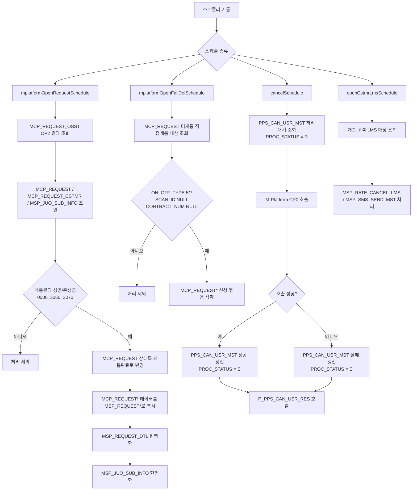
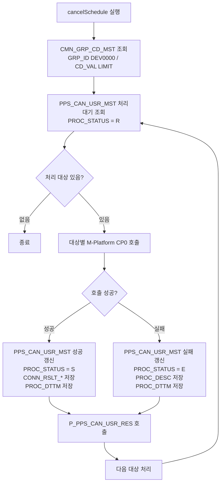

# M전산 배치/데몬 처리 테이블 정리

이 문서는 신청서 DB(MSF/SmartForm PostgreSQL)를 기준으로 M전산(MSP/MCP Oracle) 배치 또는 데몬에서 개통/해지 처리 시 확인해야 하는 테이블과, 신청서 DB에서 M전산으로 가져가야 할 데이터를 정리한다.

기준 코드는 `domains/form` 하위의 신청서 mapper/service이며, 현재 저장소에 확인된 테이블만 적었다. `@DL_MCP` 쓰기 mapper가 없는 항목은 배치/데몬 구현 대상이다.

## 공통 처리 기준

- 신청서 식별자는 `REQUEST_KEY`를 우선 사용한다.
- 해지상담/고객요청 계열은 `CUST_REQ_SEQ`를 함께 사용한다.
- M전산 반영 후 신청서 DB의 처리 상태를 반드시 갱신한다.
- 동일 `REQUEST_KEY` 또는 `CUST_REQ_SEQ`가 M전산에 이미 있으면 중복 INSERT하지 않고 상태, 스캔 ID, 오더번호 등 후속 값만 보정한다.
- 실패 시 원본 신청서 데이터는 삭제하지 않는다. 재처리할 수 있도록 상태와 오류 사유를 남긴다.

## 개통/신규·변경 신청서 DB 정리 대상

### MSF 원장 테이블

| 테이블 | 용도 |
| --- | --- |
| `MSF_REQUEST` | 신규/변경 신청서 기본 정보 |
| `MSF_REQUEST_CSTMR` | 고객, 본인인증, 주소, 연락처 정보 |
| `MSF_REQUEST_AGENT` | 대리인 또는 법정대리인 정보 |
| `MSF_REQUEST_SALE` | 판매, 상품, 요금제, 유심, 단말 관련 정보 |
| `MSF_REQUEST_BILL_REQ` | 청구, 납부, 명세서 정보 |
| `MSF_REQUEST_MOVE` | 번호이동 정보 |
| `MSF_REQUEST_ADDITION` | 부가서비스 신청 정보 |
| `MSF_REQUEST_DVC_CHG` | 기기변경 사유 정보 |
| `MSF_REQUEST_STATE` | 신청서 진행 상태 이력 |
| `MSF_REQUEST_DOC` | 첨부, 스캔, 서식지 문서 정보 |
| `MSF_REQUEST_CLAUSE` | 약관 동의 정보 |
| `MSF_REQUEST_JOIN_FORM` | 가입신청 출력 요청 정보 |
| `MSF_REQUEST_REC` | 접수 보조 정보 |
| `MSF_REQUEST_MST` | 신청서 마스터 보조 정보 |

### MSF 임시 저장 테이블

| 테이블 | 비고 |
| --- | --- |
| `MSF_REQUEST_TEMP` | 신청서 임시 기본 정보 |
| `MSF_REQUEST_CSTMR_TEMP` | 신청서 임시 고객 정보 |
| `MSF_REQUEST_AGENT_TEMP` | 신청서 임시 대리인 정보 |
| `MSF_REQUEST_SALE_TEMP` | 신청서 임시 판매 정보 |
| `MSF_REQUEST_BILL_REQ_TEMP` | 신청서 임시 청구 정보 |
| `MSF_REQUEST_MOVE_TEMP` | 신청서 임시 번호이동 정보 |
| `MSF_REQUEST_ADDITION_TEMP` | 코드상 INSERT가 주석 처리되어 있어 사용 여부 확정 필요 |

## M전산으로 가져가야 할 개통 대상

`MSF_REQUEST*` 원장 데이터를 기존 M전산 `MCP_REQUEST*` 구조로 매핑한다.

| MSF 기준 데이터 | M전산 대상 |
| --- | --- |
| `MSF_REQUEST` | `MCP_REQUEST` |
| `MSF_REQUEST_CSTMR` | `MCP_REQUEST_CSTMR` |
| `MSF_REQUEST_AGENT` | `MCP_REQUEST_AGENT` |
| `MSF_REQUEST_SALE` | `MCP_REQUEST_SALEINFO` |
| `MSF_REQUEST_BILL_REQ` | `MCP_REQUEST_REQ` |
| `MSF_REQUEST_MOVE` | `MCP_REQUEST_MOVE` |
| `MSF_REQUEST_ADDITION` | `MCP_REQUEST_ADDITION` |
| `MSF_REQUEST_DVC_CHG` | `MCP_REQUEST_DVC_CHG` |
| `MSF_REQUEST_STATE` | `MCP_REQUEST_STATE` |
| 간편/셀프개통 신청 정보 | `MCP_REQUEST_OSST` |

배송/셀프개통 흐름이 있는 경우 다음 테이블도 함께 정리한다.

- `MCP_REQUEST_SELF_DLVRY`
- `MCP_REQUEST_SELF_DLVRY_HIST`
- `MCP_REQUEST_NOW_DLVRY`
- `MCP_REQUEST_COMMEND`
- `MCP_REQUEST_PAY_INFO`
- `MCP_REQUEST_KT_INTER`

현재 저장소에는 해지 일부만 `@DL_MCP` 쓰기 mapper가 구현되어 있다. 개통 `MCP_REQUEST*` 쓰기는 배치/데몬에서 별도 구현하거나 기존 legacy mapper를 이관해야 한다.

## 해지 신청서 DB 정리 대상

### MSF 원장/이력 테이블

| 테이블 | 용도 |
| --- | --- |
| `MSF_REQUEST_CANCEL` | 서비스해지 신청 기본/처리 정보 |
| `MSF_REQUEST_CSTMR` | 해지 신청 고객 정보 |
| `MCP_CANCEL_REQUEST` | 해지상담/legacy 호환 요청 정보 |
| `NMCP_CUST_REQUEST_MST` | 고객요청 마스터 |
| `MCP_MASKING_RELEASE` | 마스킹 해제 요청 |
| `MCP_MASKING_RELEASE_HIST` | 마스킹 해제 이력 |
| `NMCP_NICE_LOG` | NICE 인증 로그 |
| `MCP_NICE_HIST` | NICE 인증 이력 |
| `MCP_NICE_TRY_HIST` | NICE 인증 시도 이력 |
| `NMCP_SELF_SMS_AUTH` | 셀프 SMS 인증 이력 |

### 해지 처리 상태

`MSF_REQUEST_CANCEL.PROC_CD` 기준으로 처리한다.

| 코드 | 의미 |
| --- | --- |
| `RC` | 접수 |
| `RQ` | 처리요청 |
| `CP` | 처리완료 |
| `BK` | 반려 |

## M전산으로 가져가야 할 해지 대상

| MSF 기준 데이터 | M전산 대상 | 현재 구현 |
| --- | --- | --- |
| `MSF_REQUEST_CANCEL` | `MCP_CANCEL_REQUEST@DL_MCP` | `McpRequestWriteMapper.insertMcpCancelRequest` |
| `MSF_REQUEST_CSTMR` | `MCP_REQUEST_CSTMR@DL_MCP` | `McpRequestWriteMapper.insertMcpRequestCstmr` |

처리 흐름:

1. 신청서 DB에서 `REQUEST_KEY` 기준으로 해지 신청과 고객 정보를 조회한다.
2. M전산 `MCP_CANCEL_REQUEST@DL_MCP`에 해지 신청 정보를 INSERT한다.
3. M전산 `MCP_REQUEST_CSTMR@DL_MCP`에 고객 정보를 INSERT한다.
4. 해지 완료 후 `MSF_REQUEST_CANCEL.PROC_CD`를 `CP`로 갱신한다.
5. 완료 취소 시 `MSF_REQUEST_CANCEL.PROC_CD`를 `RC`로 되돌린다.

AS-IS는 `BATCH00233` 실해지 후 `PROC_CD`를 갱신하는 흐름이었고, TO-BE 코드는 `EP0` 실시간 해지 성공 후 `PROC_CD='CP'`로 처리하는 흐름이다.

## AS-IS 배치데몬 처리 흐름도

### 범위 메모

- 이 흐름도는 AS-IS `msp-batch-daemon`이 직접 처리하는 배치 흐름을 우선 정리한다.
- TOBE/MSF 테이블은 아래의 "TOBE 참고" 흐름과 기존 테이블 매핑 섹션에 유지한다.
- 해지 신청 API가 저장하는 `MCP_CANCEL_REQUEST@DL_MCP`는 AS-IS 데몬 직접 폴링 대상이 아닌 것으로 정리한다.
### AS-IS 전체 배치 흐름



### TOBE 참고: 신청서 DB에서 M전산 선반영 흐름

```mermaid
flowchart LR
    A[MSF 신청서 DB] --> B[MSF_REQUEST* 정합성 확인]
    B --> C[MCP_REQUEST* @DL_MCP 선반영]
    C --> D[MCP_REQUEST_OSST@DL_MCP<br/>OSST/M-Platform 결과 적재]
    D --> E{OP2 + 성공/준성공?}
    E -- 아니오 --> F[대기 또는 오류 처리]
    E -- 예 --> G[msp-batch-daemon 개통 후처리]
    G --> H[MSP_REQUEST* 스냅샷 생성]
    H --> I[MSP_REQUEST_DTL 계약상세 현행화]
    I --> J[MSP_JUO_SUB_INFO 가입자 현행화]
```

### AS-IS 해지 데몬 처리 흐름



AS-IS 해지 데몬은 `MCP_CANCEL_REQUEST@DL_MCP`를 직접 조회하지 않고, `PPS_CAN_USR_MST.PROC_STATUS = 'R'` 대기 건을 기준으로 M-Platform `CP0` 해지 연동을 수행한다.

### 직접개통 미개통 삭제 흐름

```mermaid
flowchart TD
    A[mplatformOpenFailDelSchedule] --> B[MCP_REQUEST@DL_MCP 대상 조회]
    B --> C{직접개통 미개통?}
    C -- 조건 불일치 --> D[skip]
    C -- 조건 일치 --> E[REQUEST_KEY/RES_NO 기준 삭제]
    E --> F[MCP_REQUEST]
    E --> G[MCP_REQUEST_CSTMR]
    E --> H[MCP_REQUEST_SALEINFO]
    E --> I[MCP_REQUEST_DLVRY]
    E --> J[MCP_REQUEST_REQ]
    E --> K[MCP_REQUEST_MOVE]
    E --> L[MCP_REQUEST_PAYMENT]
    E --> M[MCP_REQUEST_AGENT]
    E --> N[MCP_REQUEST_STATE]
    E --> O[MCP_REQUEST_CHANGE]
    E --> P[MCP_REQUEST_DVC_CHG]
    E --> Q[MCP_REQUEST_ADDITION]
    E --> R[MCP_REQUEST_OSST]
```

## AS-IS 배치데몬 실제 처리 테이블

53번 AS-IS 분석 기준으로 `msp-batch-daemon`이 직접 조회/수정/삭제하는 핵심 테이블은 아래와 같다. 이 목록을 먼저 확정해야 신청서 DB에서 M전산으로 선반영해야 할 테이블 범위를 정할 수 있다.

### 스케줄별 처리 요약

| 스케줄 | 트리거/대상 | 주요 처리 테이블 | 처리 성격 |
| --- | --- | --- | --- |
| `mplatformOpenRequestSchedule` | `MCP_REQUEST_OSST@DL_MCP.PRGR_STAT_CD = 'OP2'`, `RSLT_CD IN ('0000','3060','3070')` | `MCP_REQUEST_OSST@DL_MCP`, `MCP_REQUEST@DL_MCP`, `MCP_REQUEST_CSTMR@DL_MCP`, `MSP_JUO_SUB_INFO`, `MSP_REQUEST*`, `MSP_REQUEST_DTL` | 개통 결과 후처리, MCP 신청정보를 MSP 신청/계약정보로 반영 |
| `mplatformOpenFailDelSchedule` | 직접개통(`ON_OFF_TYPE IN ('5','7')`) 중 `SCAN_ID`, `CONTRACT_NUM`이 없는 미개통 건 | `MCP_REQUEST* @DL_MCP` 신청 관련 테이블 묶음 | 미개통 직접개통 신청정보 삭제 |
| `cancelSchedule` | `PPS_CAN_USR_MST.PROC_STATUS = 'R'` | `PPS_CAN_USR_MST`, `CMN_GRP_CD_MST`, `P_PPS_CAN_USR_RES` | 직권해지 대상 M-Platform `CP0` 호출 및 결과 반영 |
| `openCstmrLmsSchedule` | 개통 고객 LMS 대상 | `MSP_RATE_CANCEL_LMS`, `MSP_SMS_SEND_MST` 계열 | 개통 고객 안내 LMS 후속 처리 |
| `rcpCustNotOpenSchedule` | 신청 후 미개통 고객 | AS-IS 추가 확인 필요 | 미개통 고객 삭제성 후속 처리 |
| `tmntCustTransferSchedule` | 해지고객 정보 | AS-IS 추가 확인 필요 | 해지고객 정보 이관성 후속 처리 |
| `tmntMcpCustDeleteSchedule` | 해지고객 MCP 정보 | AS-IS 추가 확인 필요 | 해지고객 MCP 정보 삭제성 후속 처리 |

### 개통 결과 후처리에서 읽는 테이블

`mplatformOpenRequestSchedule`의 개통완료 대상 조회 기준이다.

| 테이블 | 역할 | 주요 조건/키 |
| --- | --- | --- |
| `MCP_REQUEST_OSST@DL_MCP` | OSST/M-Platform 개통 결과 이력 | `PRGR_STAT_CD = 'OP2'`, `RSLT_CD IN ('0000','3060','3070')`, `MVNO_ORD_NO` |
| `MCP_REQUEST@DL_MCP` | M전산 신청 기본정보 | `RES_NO = TO_NUMBER(MCP_REQUEST_OSST.MVNO_ORD_NO)` |
| `MCP_REQUEST_CSTMR@DL_MCP` | M전산 신청 고객정보 | `REQUEST_KEY` |
| `MSP_JUO_SUB_INFO` | 계약/가입자 현행 정보 | `CONTRACT_NUM = MCP_REQUEST_OSST.SVC_CNTR_NO`, `SCAN_ID IS NULL OR SRL_IF_ID = 0` |

### 개통 결과 후처리에서 쓰는 테이블

개통 결과가 성공/준성공이면 MCP 신청정보를 MSP 업무 테이블로 복사하고 계약 현행 정보를 갱신한다.

| 처리 | 원천 | 대상 | 비고 |
| --- | --- | --- | --- |
| 신청 상태 변경 | `MCP_REQUEST@DL_MCP` | `MCP_REQUEST@DL_MCP` | `REQUEST_STATE_CODE = '21'` 개통완료 |
| 신청 기본정보 복사 | `MCP_REQUEST@DL_MCP` | `MSP_REQUEST` | 신청 스냅샷 생성 |
| 고객정보 복사 | `MCP_REQUEST_CSTMR@DL_MCP` | `MSP_REQUEST_CSTMR` | 고객 스냅샷 생성 |
| 판매정보 복사 | `MCP_REQUEST_SALEINFO@DL_MCP` | `MSP_REQUEST_SALEINFO` | 요금제/상품/단말/유심 |
| 배송정보 복사 | `MCP_REQUEST_DLVRY@DL_MCP` | `MSP_REQUEST_DLVRY` | 배송 신청이 있는 경우 |
| 요청정보 복사 | `MCP_REQUEST_REQ@DL_MCP` | `MSP_REQUEST_REQ` | 청구/요청 부가정보 |
| 번호이동정보 복사 | `MCP_REQUEST_MOVE@DL_MCP` | `MSP_REQUEST_MOVE` | 번호이동 신청인 경우 |
| 결제/충전정보 복사 | `MCP_REQUEST_PAYMENT@DL_MCP` | `MSP_REQUEST_PAYMENT` | 선불/결제 정보 |
| 대리점정보 복사 | `MCP_REQUEST_AGENT@DL_MCP` | `MSP_REQUEST_AGENT` | 대리점/상담원 정보 |
| 상태이력 복사 | `MCP_REQUEST_STATE@DL_MCP` | `MSP_REQUEST_STATE` | 신청 진행상태 |
| 변경정보 복사 | `MCP_REQUEST_CHANGE@DL_MCP` | `MSP_REQUEST_CHANGE` | 신청 변경정보 |
| 기변사유 복사 | `MCP_REQUEST_DVC_CHG@DL_MCP` | `MSP_REQUEST_DVC_CHG` | 기기변경 신청인 경우 |
| 부가서비스 복사 | `MCP_REQUEST_ADDITION@DL_MCP` | `MSP_REQUEST_ADDITION` | 부가서비스 신청정보 |
| 계약상세 현행화 | `MCP_REQUEST* @DL_MCP` | `MSP_REQUEST_DTL` | `CONTRACT_NUM` 기준 `SCAN_ID`, `ON_OFF_TYPE`, `RES_NO`, `REQUEST_KEY`, 상태값 등 갱신 |
| 가입자 현행화 | `MCP_REQUEST_OSST@DL_MCP` + 신청정보 | `MSP_JUO_SUB_INFO` | `SRL_IF_ID`, `SCAN_ID`, `MNP_IND_CD`, `ON_OFF_TYPE`, `OSST_YN='Y'` 갱신 |

### 직접개통 미개통 삭제 대상 테이블

`mplatformOpenFailDelSchedule`은 직접개통 유형 중 당일까지 미개통인 신청을 MCP 신청 테이블 묶음에서 삭제한다. 조건은 `MCP_REQUEST@DL_MCP.ON_OFF_TYPE IN ('5','7')`, `SCAN_ID IS NULL`, `CONTRACT_NUM IS NULL`이다.

| 삭제 대상 테이블 |
| --- |
| `MCP_REQUEST@DL_MCP` |
| `MCP_REQUEST_CSTMR@DL_MCP` |
| `MCP_REQUEST_SALEINFO@DL_MCP` |
| `MCP_REQUEST_DLVRY@DL_MCP` |
| `MCP_REQUEST_REQ@DL_MCP` |
| `MCP_REQUEST_MOVE@DL_MCP` |
| `MCP_REQUEST_PAYMENT@DL_MCP` |
| `MCP_REQUEST_AGENT@DL_MCP` |
| `MCP_REQUEST_STATE@DL_MCP` |
| `MCP_REQUEST_CHANGE@DL_MCP` |
| `MCP_REQUEST_DVC_CHG@DL_MCP` |
| `MCP_REQUEST_ADDITION@DL_MCP` |
| `MCP_REQUEST_OSST@DL_MCP` |

### 해지 배치데몬 처리 테이블

AS-IS `cancelSchedule`은 해지 신청 테이블인 `MCP_CANCEL_REQUEST@DL_MCP`를 직접 폴링하지 않는다. 배치데몬의 즉시성 해지 처리는 `PPS_CAN_USR_MST` 기반 직권해지 흐름이다.

| 테이블/프로시저 | 역할 | 주요 조건/갱신 |
| --- | --- | --- |
| `PPS_CAN_USR_MST` | 직권해지 처리 큐 | 대상: `PROC_STATUS = 'R'`; 성공: `S`; 실패: `E`; 결과코드/메시지/처리일시 저장 |
| `CMN_GRP_CD_MST` | 처리 건수 제한 공통코드 | `GRP_ID = 'DEV0000'`, `CD_VAL = 'LIMIT'`, `ETC1` |
| `P_PPS_CAN_USR_RES` | 해지 결과 반영 프로시저 | M-Platform `CP0` 호출 후 결과 전달 |
| `MCP_CANCEL_REQUEST@DL_MCP` | 해지 신청/접수 데이터 | MSF 해지 API가 저장하지만 AS-IS 배치데몬 직접 폴링은 확인되지 않음 |
| `MCP_REQUEST_CSTMR@DL_MCP` | 해지 신청 고객정보 | MSF 해지 API가 `MSF_REQUEST_CSTMR` 기준으로 저장 |

### 55번 문서 기준 결론

- 개통 후처리를 AS-IS 배치데몬과 맞추려면 신청서 DB의 `MSF_REQUEST*` 데이터를 M전산 `MCP_REQUEST* @DL_MCP`에 먼저 맞춰 넣어야 한다. 이후 배치데몬이 `MCP_REQUEST_OSST@DL_MCP`의 `OP2` 결과를 기준으로 `MSP_REQUEST*`, `MSP_REQUEST_DTL`, `MSP_JUO_SUB_INFO`를 처리한다.
- 직접개통 미개통 삭제까지 고려하면 M전산에 넣는 신청 테이블 묶음은 삭제 대상 테이블 묶음과 동일한 범위로 맞추는 것이 안전하다.
- 해지 신청은 현재 MSF API가 `MCP_CANCEL_REQUEST@DL_MCP`, `MCP_REQUEST_CSTMR@DL_MCP`까지 저장하지만, AS-IS 배치데몬은 이를 직접 처리하지 않는다. 해지 신청 후속 처리를 배치로 할지, 현재처럼 `EP0` 실시간 처리로 끝낼지 별도 확정이 필요하다.

## 배치/데몬 구현 체크리스트

- 대상 추출 조건은 처리 전 상태, 필수 키(`REQUEST_KEY`, `CUST_REQ_SEQ`, 계약번호, CTN) 존재 여부로 제한한다.
- M전산 INSERT 전 동일 키 중복 여부를 확인한다.
- M전산 반영 후 MSF 상태를 갱신한다.
- 개통은 `MSF_REQUEST*` 묶음 전체가 한 신청서 단위로 정합성을 가져야 한다. 고객/판매/청구/번호이동/부가서비스 중 하나라도 누락되면 M전산 반영을 보류한다.
- 해지는 `MSF_REQUEST_CANCEL`과 `MSF_REQUEST_CSTMR`가 함께 반영되어야 한다. `MCP_CANCEL_REQUEST@DL_MCP`만 생성되고 고객 정보가 누락되면 후속 해지 처리에서 장애가 난다.
- 실패 건은 원본 데이터를 삭제하지 않고 재처리 큐 또는 실패 상태로 남긴다.


